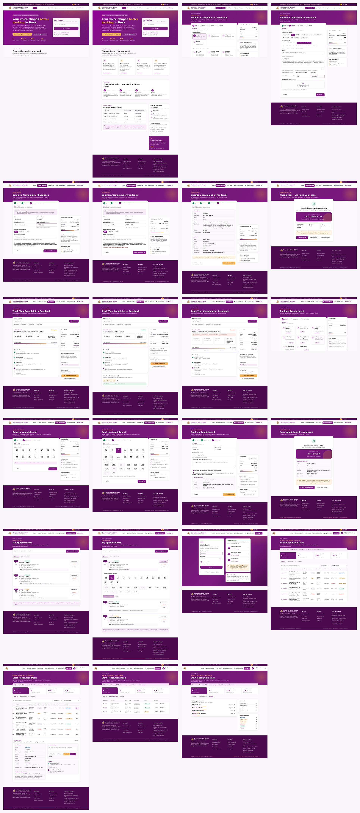
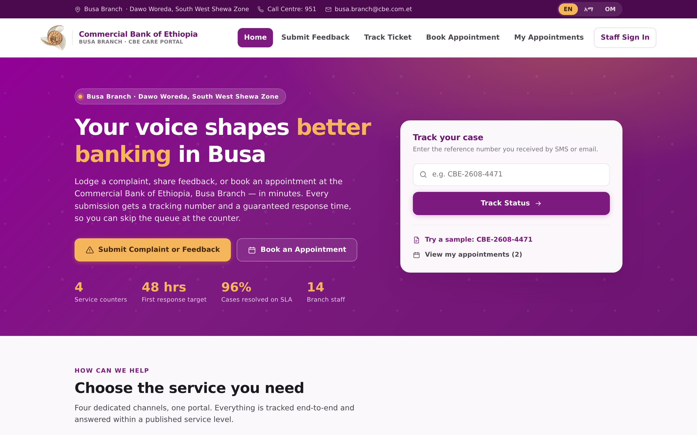
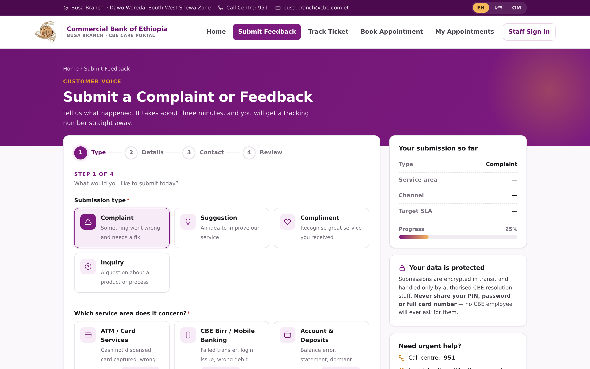
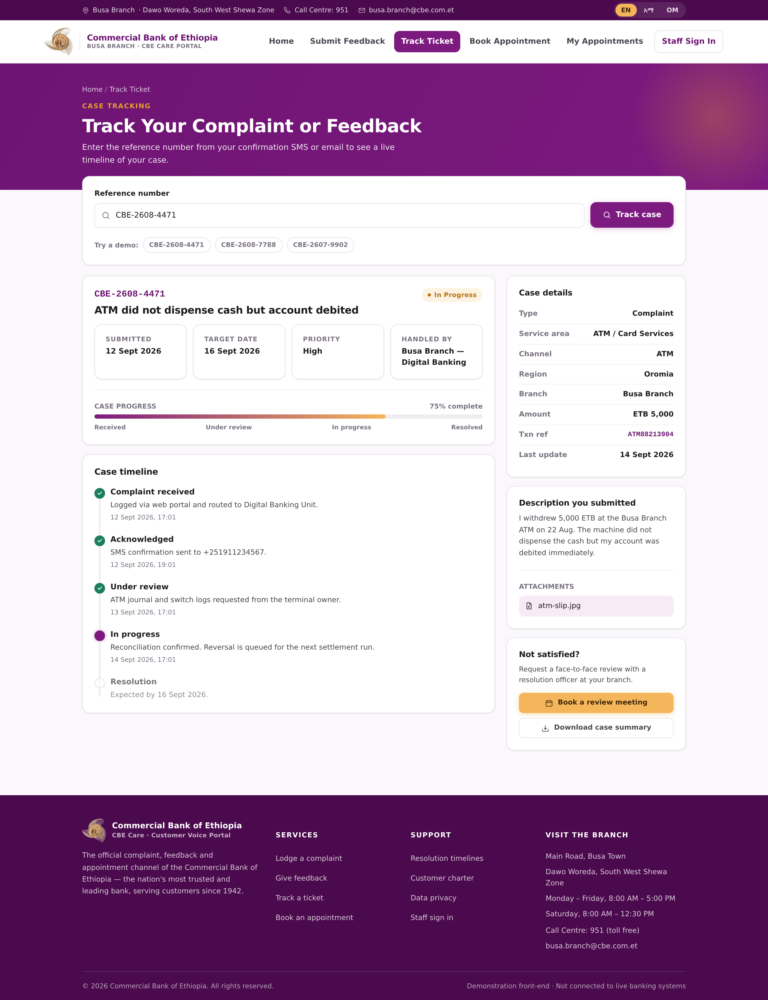
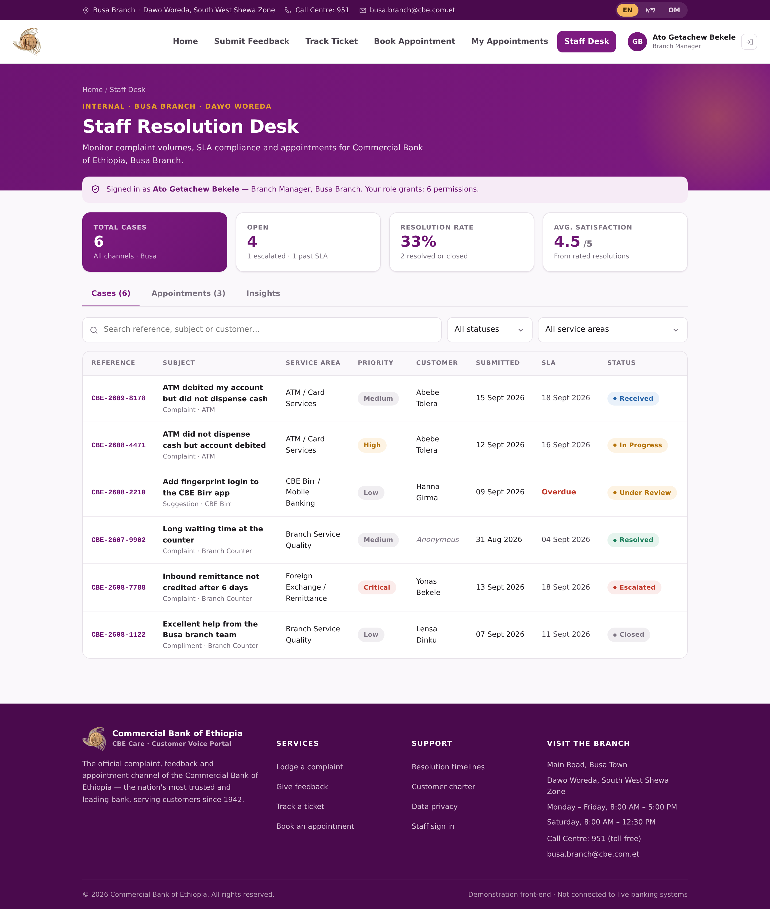

# CBE Care — Complaint, Feedback & Appointment Portal

A production-style **frontend** for the Commercial Bank of Ethiopia's customer voice system, built with React + Vite and styled entirely in the official CBE brand palette.

---

## Brand colours

Sourced directly from the stylesheet on **combanketh.et**:

| Token | Hex | Usage |
|---|---|---|
| CBE Purple | `#9C278B` | Primary actions, navigation, headers |
| CBE Purple (deep) | `#910096` | Gradient companion |
| Purple Dark | `#6B0F63` | Hover states, headings |
| Purple Darkest | `#4A0A45` | Utility bar, footer |
| CBE Gold | `#E8A029` | Accents, secondary CTAs, highlights |
| Neutral Grey | `#A6A6A6` | Muted text, empty states |

All colours are CSS custom properties in `src/styles.css` — change them in one place to re-theme.

---

## Running it

```bash
cd cbe-care
npm install      # already installed in this workspace
npm run dev      # dev server on 0.0.0.0:5173
npm run build    # production bundle → dist/
npm run preview  # serve the production build
```

---

## Screens

| Route | Screen | What it does |
|---|---|---|
| `/` | **Home** | Hero, quick ticket lookup, 4 service cards, process rail, published SLA table |
| `/submit` | **Complaint & Feedback** | 4-step wizard: Type → Details → Contact → Review, with live sidebar summary |
| `/track` | **Track Ticket** | Reference lookup, progress bar, case timeline, star rating on resolved cases |
| `/appointment` | **Book Appointment** | 3-step wizard: Service → Date & Time → Details, live slot availability |
| `/my-appointments` | **My Appointments** | Upcoming / Past / Cancelled tabs, inline reschedule, cancel, print |
| `/login` | **Staff Sign In** | Mock authentication with three demo accounts and role descriptions |
| `/admin` | **Staff Resolution Desk** | _Requires sign-in._ | KPI tiles, filterable case table, case drawer with status workflow, appointments queue, insights |

---

## Scope

The portal is scoped to a single branch: **Commercial Bank of Ethiopia, Busa Branch** —
Main Road, Busa Town, Dawo Woreda, South West Shewa Zone, Oromia. Customer-facing forms ask
which locality you are based in (Busa kebeles, Dawo woreda, neighbouring woredas) rather than
asking you to choose a branch.

---

## Features

**Complaint & Feedback**
- Four submission types — complaint, suggestion, compliment, inquiry
- Eight service areas, each with its own published SLA (2–7 business days)
- Severity levels driving response times; anonymous submission supported
- Per-step validation: Ethiopian mobile format (`09xxxxxxxx` / `+2519xxxxxxxx`), 10–16 digit account numbers, email, minimum description length
- File attachment UI, character counters, consent gate (NBE consumer-protection wording)
- Auto-generated reference `CBE-YYMM-NNNN` + calculated target resolution date

**Appointments**
- Eight bookable services with realistic durations (20–60 min)
- 14-day date strip that skips Sundays; Saturday afternoons shown as closed
- Live slot availability — real bookings plus deterministic branch load
- Single-branch scope: every booking is for CBE Busa Branch, so there is no branch-picking step
- Reschedule and cancel with conflict-aware slot re-checking
- Booking reference `APT-NNNNN`

**Staff authentication (mock)**
- Three demo accounts, all with password `busa@123`:

| Username | Name | Role | Can do |
|---|---|---|---|
| `manager` | Ato Getachew Bekele | Branch Manager | Everything, including closing cases |
| `officer` | W/ro Meseret Alemu | Customer Service Officer | Update + escalate, cannot close |
| `teller` | Ato Dawit Fikru | Senior Teller | Read-only cases, manages appointments |

- `/admin` is guarded — signed-out visitors are redirected to `/login` and returned to their
  destination after signing in
- Session persists in `localStorage` (`cbe_care_session_v1`); signed-in user chip with sign-out in the masthead
- Role permissions actually gate the UI: restricted status buttons are disabled, and the
  teller sees a read-only notice instead of the update controls
- Client-side only — this is a demonstration of the *flow*, not real security

**Staff Desk**
- KPIs: total, open, escalated, overdue-vs-SLA, resolution rate, average CSAT
- Search + status + service-area filters
- Case drawer: full record, staff note field, one-click status transitions that write to the customer-visible timeline
- Insights tab: volume by service area, SLA health, status breakdown

**Cross-cutting**
- Fully responsive — desktop, tablet, mobile with hamburger nav
- Print stylesheet for receipts, case summaries and booking confirmations
- Inline SVG icon set (no icon-font or CDN dependency)
- Trilingual language switcher UI (EN / አማ / OM)
- Zero external assets — renders fully offline

---

## Architecture

```
cbe-care/
├── index.html
├── vite.config.js
└── src/
    ├── main.jsx              # routes (HashRouter — deploys to any static host)
    ├── styles.css            # design system, all brand tokens
    ├── data.js               # reference data + persistence layer
    ├── components/
    │   ├── Layout.jsx        # utility bar, masthead, nav, footer
    │   ├── Icon.jsx          # 34 inline SVG icons
    │   └── UI.jsx            # PageHead, Stepper, Field, Alert, Badge, Toast, Empty
    └── pages/
        ├── Home.jsx  Complaint.jsx  Track.jsx
        ├── Appointment.jsx  MyAppointments.jsx  Admin.jsx
```

**Data layer.** `src/data.js` persists to `localStorage` behind API-shaped functions — `getTickets()`, `saveTicket()`, `findTicket()`, `updateTicket()`, `getAppointments()`, `saveAppointment()`, `updateAppointment()`, `bookedSlots()`. Swap those bodies for `fetch` calls and the UI needs no changes. Five demo tickets and two demo appointments seed on first load.

---

## Try it

1. **Track a case** — go to `/track` and use `CBE-2608-4471` (in progress), `CBE-2608-7788` (escalated) or `CBE-2607-9902` (resolved — lets you leave a star rating).
2. **Submit a complaint** — `/submit`, then track the reference you get back.
3. **Book an appointment** — `/appointment`, then manage it at `/my-appointments`.
4. **Work a case as staff** — `/admin`, open any case, add a note and change the status, then re-track it as a customer to see your note on the timeline.

---

*Demonstration front-end. Not connected to live CBE banking systems.*

---

## Screenshots

26 screenshots captured from the live app are in **[`docs/screenshots/`](docs/screenshots/)**,
with a full index in [`docs/screenshots/README.md`](docs/screenshots/README.md).

Start with the contact sheet:



| | |
|---|---|
|  |  |
| **Landing page** — hero, ticket lookup, KPIs | **Complaint intake** — type + service area |
|  |  |
| **Case tracking** — timeline and SLA | **Staff desk** — KPIs and case queue |

Regenerate them with:

```bash
npx playwright install chromium
npm run dev              # shell 1
node scripts/shoot.mjs   # shell 2
```

---

## Branding

The official **CBE Birr** logo ships in two variants, generated from the source artwork:

- `src/assets/cbe-birr-logo.png` — light backgrounds (masthead)
- `src/assets/cbe-birr-logo-white.png` — purple backgrounds (footer)

Primary purple `#6D1472` and gold `#F5B55B` are sampled directly from the logo pixels.
